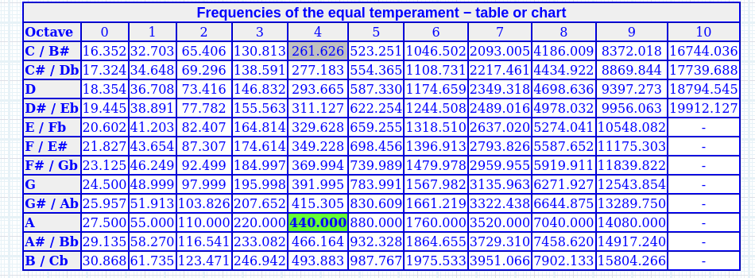
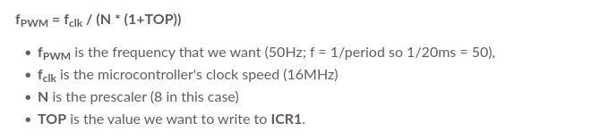
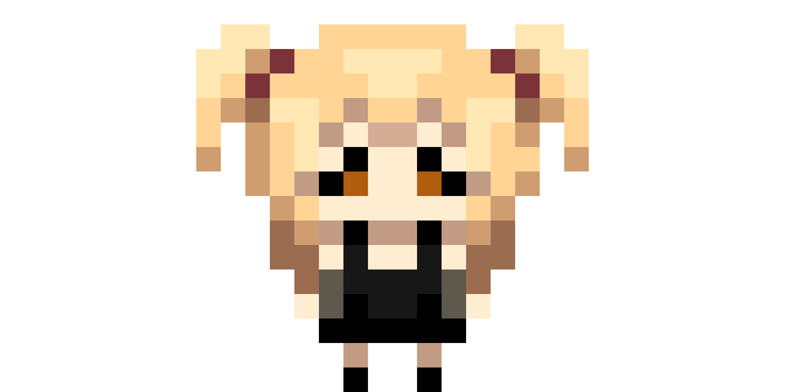
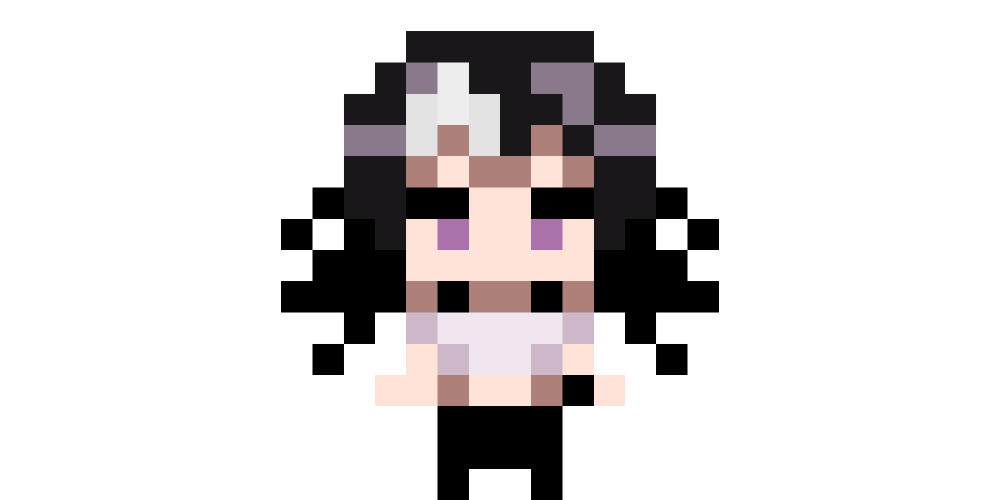
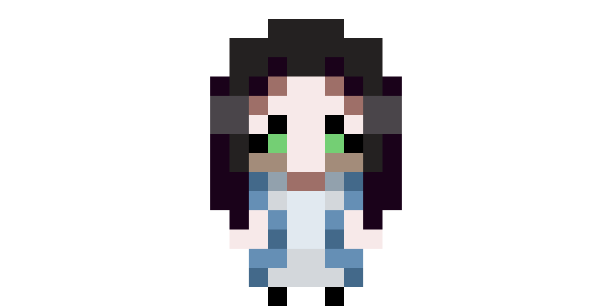
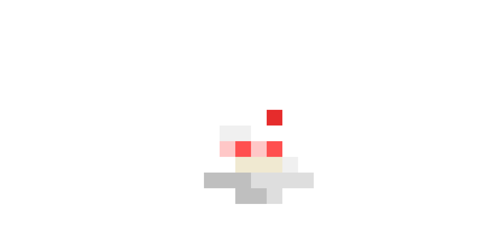
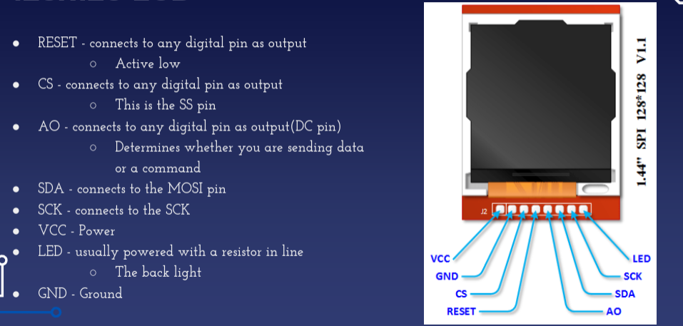
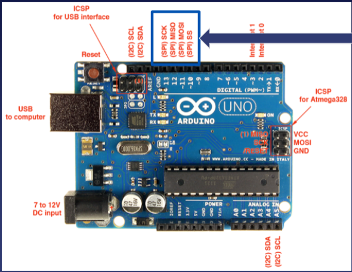
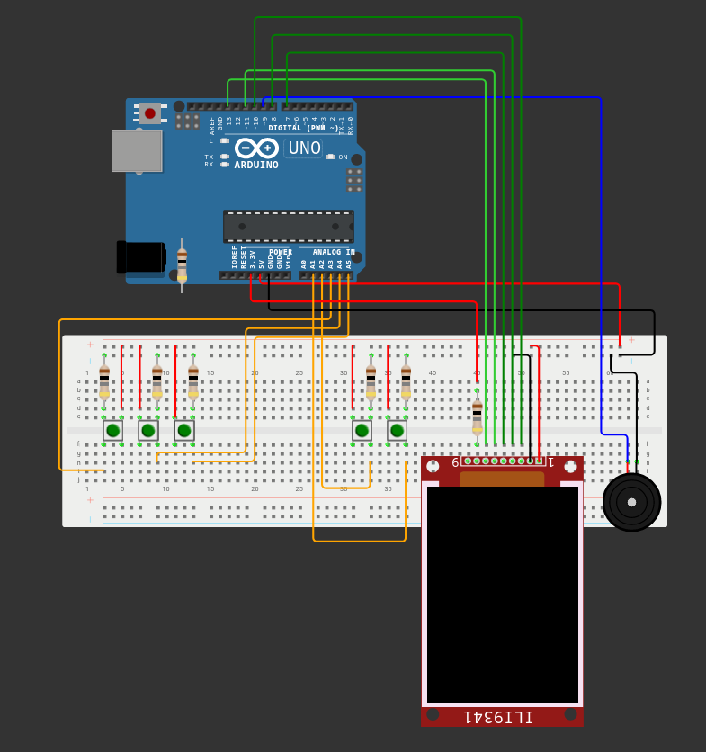
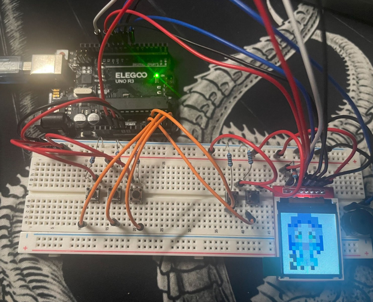

# Tamagotchi
Making a Tamagotchi was always a big goal of mine as an aspiring student in CS. After completing my first data structures class, and knowing personal projects would teach me alot, I wanted my first project to be something I truly found fun, and interesting, that being a Tamagotchi. However, at the time, I had no experience with peripherals, embedded systems, etc., so it wasn't until I needed to complete this project for a grade that I really got motivated. So, in about 95 hours over the course of 3 weeks, I was able to make my dream project that I always wanted to as an aspiring freshman. Not only did this experience teach me so much, it also taught me just what I was capable off, where a project I use to believe waas so far outside my skillset was fully realized in front of me.

# Goals
In order to recieve full credit for the project, requirments were needed, mainly in the form of 3 build upons. I will list those below, but there were other aspects of the project I wanted to realize. All my goals for the project were:
* Use the ST7735 Hi-LetGo Display
* Use of a Passive Buzzer for Sound Effects + Music
* Implement all aspects of a tamagotchi, including
  * 3 Mini-Games that affect the pets happiness
  * 2 food select options, where the proper food needs to be selected
  * a status menu to check on the pets status
  * The pet needing to be looked after, where system checks would occur after a period of time.
* Have 2 possible pet to take care of at once
* 3 sprites
* Non-Volatile Memory
  Needless to say, this was a huge undertaking to attempt to implement all of this in such a short time frame, but with a little determination (and grade on the line) , I'm proud to say I left not one goal unchecked.

# Components
* Hi-LetGo SY7735 LCD Screen 128 * 128
* Passive Buzzer
* 5 Buttons
* ELEEGO UNO Microcontroller

# Implementation
 In terms of development enviroment, vscode + PlatformIO was used as reccomended by the class. As an embedded system, the code is written in C, as C was best used to mimic state machine design through periods and such. Before getting into the specifcs of each header file, overall, the project was seperated into multiple tasks, intercomminicating through global variables. Due to the timecrunch, the design of this embedded system is very rough. Many decisions were made both in implentation and planning due to wanting to be safe learning things for the first time, without wanting to fall behind on schedule. I will link a video within this readme where I can verbalizie further the improvements I would've made, and how the project could be improved. 
<ins> Use of ANY Arduino library was not permitted, so this is all done without the use of any such resource <ins>
 
 # S7735.h

This header file includes helper function to assist in interaction with the LCD screen. Functions to Prepare Data vs. Preparing Commands were needed, as that is how interaction worked with the screen. I abstracted the screen to be a 16 * 16 screen, which while making everything nice, did eventually have an effect on runtime throughout the program, as writing one pixel was really 64 pixels. WritePixel() was used to abstract the screen, along with passing in colors. There was an issue with the peripheral i recieved, so I made fixbits() to simply reverse the hexadecimal value of the color I was attempting to write. This header also includes all sprite functions, which would print the sprite, as well as printing in certain location, taking in a x and y value. An obvious fix for the amount of lines in the file ( 3000+ ) would be a for loop that iterates over and array, using WritePixel), but I did not do so as it would complicate debugging, and I used the process of making every indivudal pixel to familiarze myself with interacting with the screen. 

# Pet.h and Game.h Files
Many of these files are simple structs, simply used to have some cleanliness. They contatin the defintions for each, as each game itself is an object. 

# Passive Buzzer
In order to interact with the passive buzzer, use of a timer was needed, which on the microcontroller was on OCR1A and ICR1. Depending on the frequency sent, a specific tone would play, and iterating over these tones in an array would play music. There were simple tones used for sound effects, but I used sheet music, to transcribe Solitiude - Sakamoto, linked under:

https://youtu.be/HBm2YKibeLA?si=WfXIPw5MsBL0YyMj

It wasn't the direct frequency, but instead the frequency needed was used in this calculation, for the value that needed to be written to ICR1:

# Interaction
The user can interact with the tamagotchi as follows:
* Initally, the pet is in the form of an egg 
  *Using B2, the middle button, the user can switch what pet is currently selected, indicated by a number in the lower left screen
* The user can use B1, the left button, to enter the select menu, where they can select two actions, feed or play
  * upon choosing feed, the user must choose the correct food option to feed the pet, which can be found by checking on the pet status
  * upon choosing game, the player can choose what game to play, using left and right to select. They can confirm with B2
* In the main menu, the user can use B3, right, to see the pet status
  * There are indicators for angry, sad, and happy, as well as the desired food being displayed
* B4, next to the screen can be used to toggle the music
* B5 can be used to reset the CURRENT Pet
* After a set time, the egg will hatch for both pets

# Games
The Tamagotchi has 3 games:
*Apple Catching
*Simon Says
*Ryuk Bird
In apple catching, the player uses B1 and B3 to move a basket and catch apples. After 6, the player wins.
In Simon Says, the player must match the onscreen buttons with B1 and B2 , 3 times to win.
In Ryuk Bird, the player must use B2 to jump over a ryuk head, which is attempting to eat the player controlled apple.
The number of games won intially affect what pet is hatched.

# Summary
This project was truly a passion project for me, which I am so proud of myself for completing. There's so much about the project I can only explain in words, so I would love if you tuned into the short video I made showcasing and telling my story. In the future, I hope to make more permament connections, and truly make this a portable pet. Below Are images of other resources / items used.

